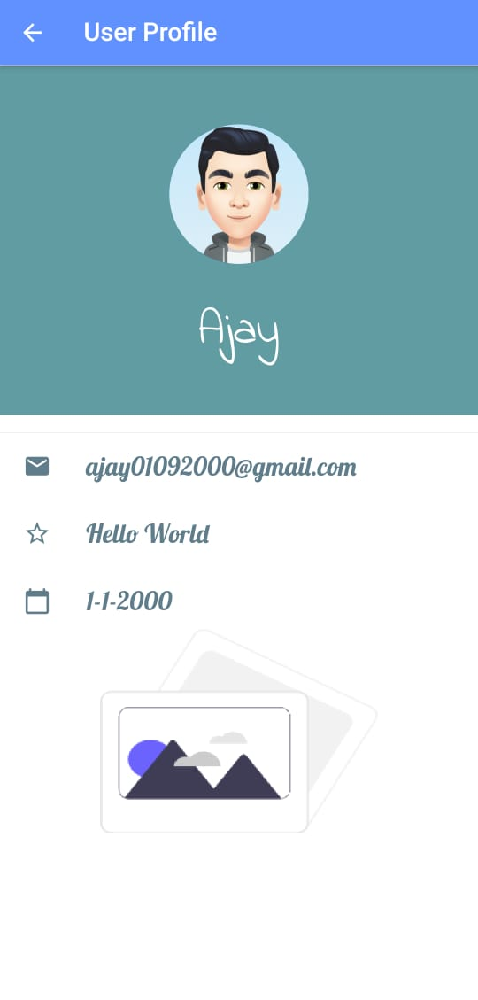
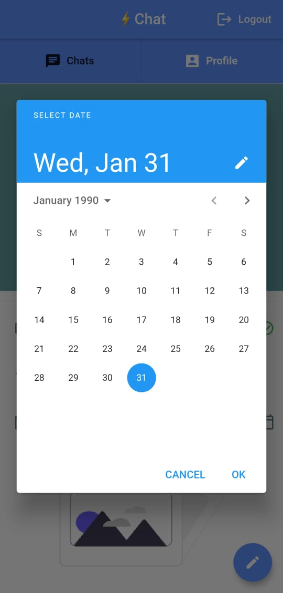
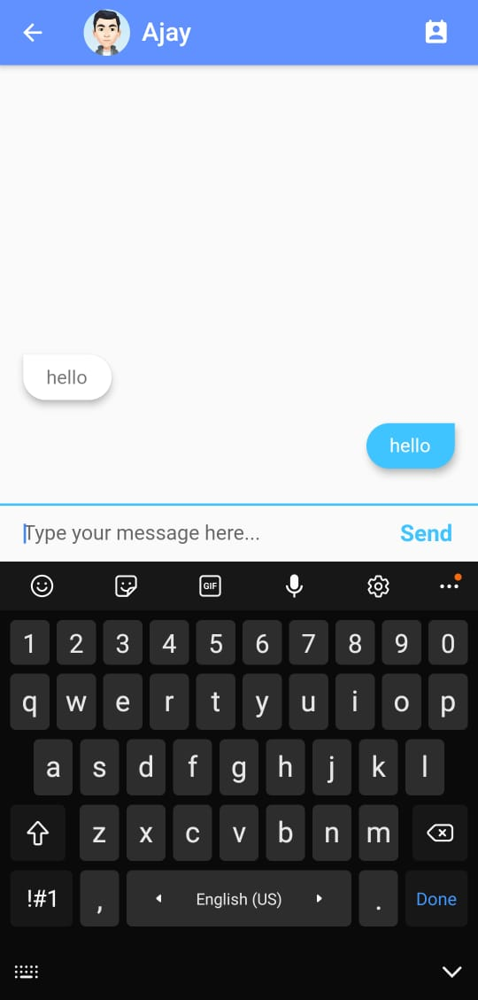
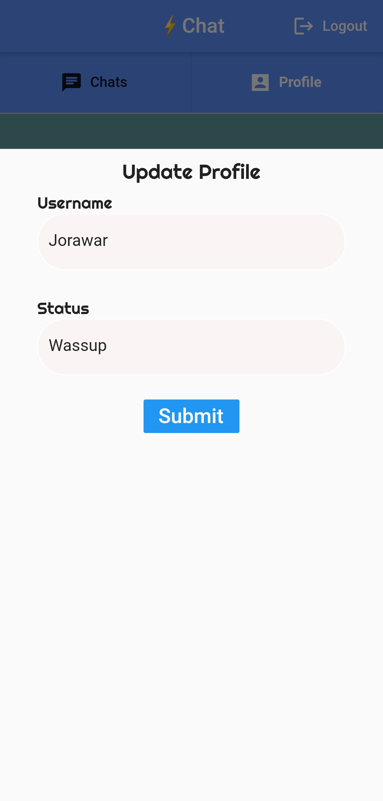

# Local.ly

## This is a Flutter based modern Android and iOS messageing App.
## We have developed graphics based on .

## Functionalities and Pages:-

-> Registeration and SignUp Pages.
-> User profile page with editing capabilites.
-> Other people Profile Page
-> Listing all users 
-> Individual Chat App.

### Technologies Used:

1. Flutter 
2. Dart 
3. Firebase Authentication
4. FireStore

## Our App ScreenShots

   
   
   
 

 
   
   

