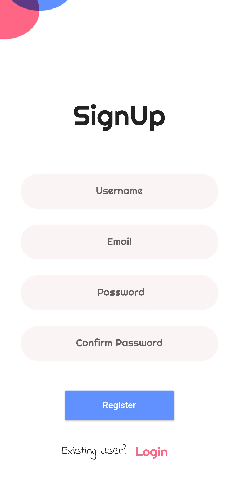

# Local.ly

## This is a Flutter based modern Android and iOS messageing App.
## Users can send personal messages to other users.
## Profile can be edited and other user profile can be seen.
## We have developed prototypes for graphics in Figma .

## Functionalities and Pages:-

-> Registeration and SignUp Pages.
-> User profile page with editing capabilites.
-> Other people Profile Page
-> Listing all users 
-> Individual Chat Pages.

### Technologies Used:

1. Flutter 
2. Dart 
3. Firebase Authentication
4. FireStore

## Our App ScreenShots

### Login UI

 
 

### Main App UI

 
 
 

### Displays Relevant Validation Erros

   
   

### We will soon be publishing it on the playstore given we develop all necessary features.
